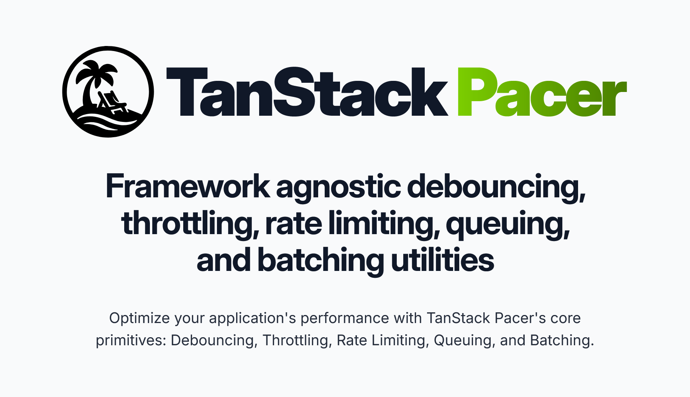

  

# TanStack Pacer

A lightweight timing and scheduling library for debouncing, throttling, rate limiting, and managing complex async workflows.

- Debouncing, throttling & rate limiting with sync/async support
- Queuing & batching utilities with pause, resume & cancel controls
- Framework adapters (React, Solid, etc.) with convenient hooks
- Fully type‑safe with small, tree‑shakeable utilities

> You may know **TanSack Pacer** by our adapter names, too!
>
> - [**React Pacer**](https://tanstack.com/pacer/latest/docs/framework/react/react-pacer)
> - [**Solid Pacer**](https://tanstack.com/pacer/latest/docs/framework/solid/solid-pacer)
> - Angular Pacer - needs a contributor!
> - Preact Pacer - Coming soon! (After React Pacer is more fleshed out)
> - Svelte Pacer - needs a contributor!
> - Vue Pacer - needs a contributor!

<a href="https://tanstack.com/pacer" style="font-weight:bold" >Read the Pacer docs →</a>
 

	
	
	

	<!-- Best of JS -->
	<a href="https://bestofjs.org/projects/<library>">
		%26since=daily" alt="Best of JS"/>
	</a>
	

[Become a Sponsor!](https://github.com/sponsors/tannerlinsley/)

## Get Involved

- We welcome issues and pull requests!
- Participate in [GitHub discussions](https://github.com/TanStack/pacer/discussions)
- Chat with the community on [Discord](https://discord.com/invite/WrRKjPJ)
- See [CONTRIBUTING.md](./CONTRIBUTING.md) for setup instructions

## Partners

		
  
  <a href="https://www.unkey.com/?utm_source=tanstack">
     <path d='M10.8 30.3C4.8 30.3 1.38 27.12 1.38 21.66V9.9H4.59V21.45C4.59 25.5 6.39 27.18 10.8 27.18C15.21 27.18 17.01 25.5 17.01 21.45V9.9H20.25V21.66C20.25 27.12 16.83 30.3 10.8 30.3ZM26.3611 30H23.1211V15.09H26.0911V19.71H26.3011C26.7511 17.19 28.7311 14.79 32.5111 14.79C36.6511 14.79 38.6911 17.58 38.6911 21.03V30H35.4511V21.9C35.4511 19.11 34.1911 17.7 31.1011 17.7C27.8311 17.7 26.3611 19.38 26.3611 22.62V30ZM44.8181 30H41.5781V9.9H44.8181V21H49.0781L53.5481 15.09H57.3281L51.7181 22.26L57.2981 30H53.4881L49.0781 23.91H44.8181V30ZM66.4219 30.3C61.5319 30.3 58.3219 27.54 58.3219 22.56C58.3219 17.91 61.5019 14.79 66.3619 14.79C70.9819 14.79 74.1319 17.34 74.1319 21.87C74.1319 22.41 74.1019 22.83 74.0119 23.28H61.3519C61.4719 26.16 62.8819 27.69 66.3319 27.69C69.4519 27.69 70.7419 26.67 70.7419 24.9V24.66H73.9819V24.93C73.9819 28.11 70.8619 30.3 66.4219 30.3ZM66.3019 17.34C63.0019 17.34 61.5619 18.81 61.3819 21.48H71.0719V21.42C71.0719 18.66 69.4819 17.34 66.3019 17.34ZM78.9586 35.1H76.8286V32.16H79.7386C81.0586 32.16 81.5986 31.8 82.0486 30.78L82.4086 30L75.0586 15.09H78.6886L82.4986 23.01L83.9686 26.58H84.2086L85.6186 22.98L89.1286 15.09H92.6986L84.9286 31.62C83.6986 34.29 82.0186 35.1 78.9586 35.1Z' fill='black' /></svg>" height="60" alt="Unkey"/>
  </a>

  

    
      Pacer
      <svg stroke="currentColor" fill="none" stroke-width="2" viewBox="0 0 24 24" stroke-linecap="round" stroke-linejoin="round" height="1em" width="1em" xmlns="http://www.w3.org/2000/svg"><path d="M19.5 12.572l-7.5 7.428l-7.5 -7.428a5 5 0 1 1 7.5 -6.566a5 5 0 1 1 7.5 6.572"></path><path d="M12 6l-3.293 3.293a1 1 0 0 0 0 1.414l.543 .543c.69 .69 1.81 .69 2.5 0l1 -1a3.182 3.182 0 0 1 4.5 0l2.25 2.25"></path><path d="M12.5 15.5l2 2"></path><path d="M15 13l2 2"></path></svg>
      You?
    
    

      We're looking for TanStack Pacer Partners to join our mission! Partner with us to push the boundaries of TanStack Pacer and build amazing things together.
    

    <a href="mailto:partners@tanstack.com?subject=TanStack Pacer Partnership" style="text-transform: uppercase; font-weight: bold;">Let's chat</a>
  

## Explore the TanStack Ecosystem

	<a href="https://github.com/tanstack/config" style="font-weight: bold;">TanStack Config</a> – Tooling for JS/TS packages 
	 
	<a href="https://github.com/tanstack/db" style="font-weight: bold;">TanStack DB</a> – Reactive sync client store 
	 
	<a href="https://github.com/tanstack/devtools" style="font-weight: bold;">TanStack DevTools</a> – Unified devtools panel 
	 
	<a href="https://github.com/tanstack/form" style="font-weight: bold;">TanStack Form</a> – Type‑safe form state
	 
	<a href="https://github.com/tanstack/query" style="font-weight: bold;">TanStack Query</a> – Async state & caching 
	 
	<a href="https://github.com/tanstack/ranger" style="font-weight: bold;">TanStack Ranger</a> – Range & slider primitives 
	 
	<a href="https://github.com/tanstack/router" style="font-weight: bold;">TanStack Router</a> –  Type‑safe routing, caching & URL state
	 
	<a href="https://github.com/tanstack/router" style="font-weight: bold;">TanStack Start</a> –  Full‑stack SSR & streaming
	 
	<a href="https://github.com/tanstack/store" style="font-weight: bold;">TanStack Store</a> – Reactive data store 
	 
	<a href="https://github.com/tanstack/table" style="font-weight: bold;">TanStack Table</a> – Headless datagrids 
	 
	<a href="https://github.com/tanstack/virtual" style="font-weight: bold;">TanStack Virtual</a> – Virtualized rendering 
	 
  … and more at <a href="https://tanstack.com" style="font-weight: bold;">TanStack.com »</a>

<!-- USE THE FORCE LUKE -->
